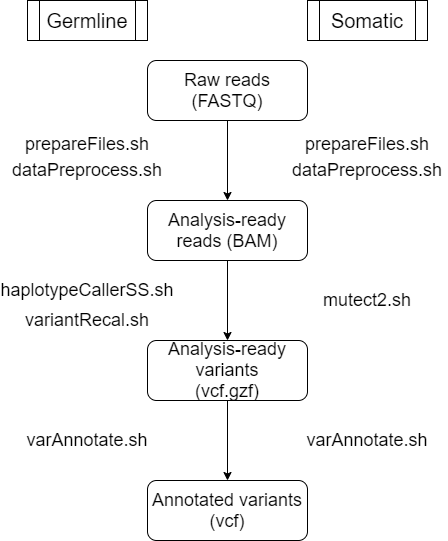

# Variant Calling Workflows
Last update: 2021-01-27

There are workflows for germline or somatic variant calling based on GATK Best Practices Workflows.
It includes:

* Preparing required files: prepareFiles.sh
* Data Pre-processing: dataPreprocess.sh
* Germline variant calling for single-sample: haplotypeCallersSS.sh
* Somatic variant calling for single-sample: mutect2.sh
* Variant recalibration using VQSR (only for human samples): variantRecal.sh
* Variant annotation using VEP: varAnnotate.sh

## Environment and dependencies:
* gatk4         v4.1.9.0
* bcftools      v1.11
* picard        v2.23.4
* ensembl-vep   v101.0

## Input
* Paired-end fastq data
* Refrence from [GATK resource bundle](https://gatk.broadinstitute.org/hc/en-us/articles/360035890811-Resource-bundle)
[Using Google Cloud SDK to download GATK resource bundle files](https://davetang.org/muse/2020/02/21/using-google-cloud-sdk-to-download-gatk-resource-bundle-files/)

## Output
* Annotated variant file

## References
* From FastQ Data to High-Confidence Variant Calls: The Genome Analysis Toolkit Best Practices Pipeline. Van der Auwera GA, Carneiro M, Hartl C, Poplin R, del Angel G, Levy-Moonshine A, Jordan T, Shakir K, Roazen D, Thibault J, Banks E, Garimella K, Altshuler D, Gabriel S, DePristo M, 2013 CURRENT PROTOCOLS IN BIOINFORMATICS 43:11.10.1-11.10.33
* The Ensembl Variant Effect Predictor. McLaren, W., Gil, L., Hunt, S.E. et al. Genome Biol 17, 122 (2016). https://doi.org/10.1186/s13059-016-0974-4
